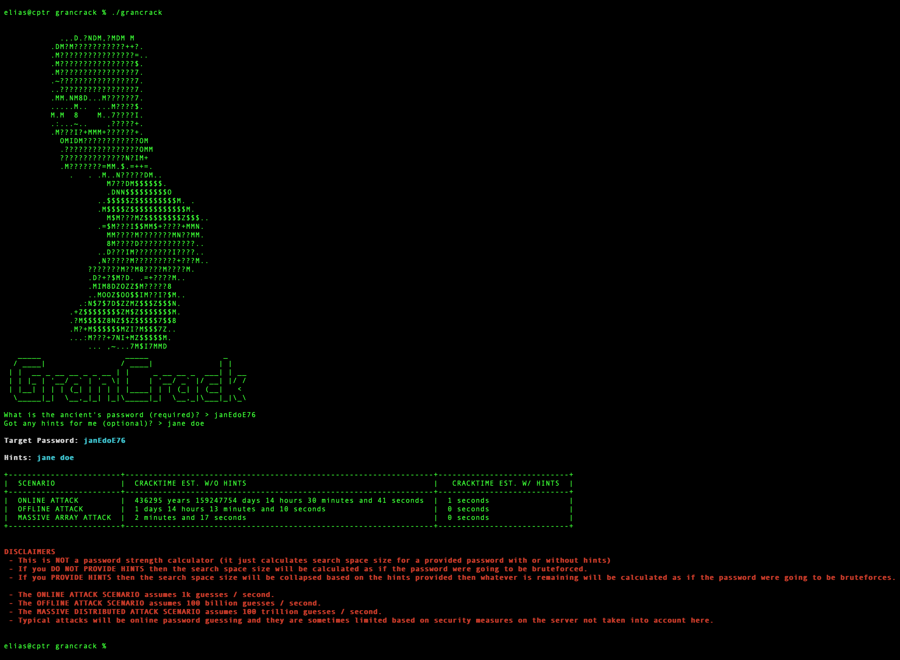

# GranCrack
A script to go with this medium article [A How-To Guide: Convincing Your Ancients to Practice Good Security](https://medium.com/@mck.workman/a-how-to-guide-convincing-your-ancient-s-to-practice-good-security-e665cc013f2d)

 

# Usage

Make the script executable
```bash
chmod +x grancrack
```

Run it (use `--help` or `-h` for help)
```bash
./grancrack
```

